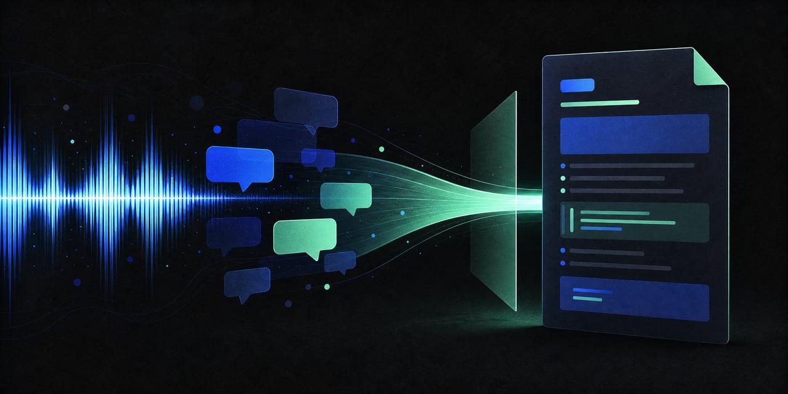

# Conversation to Markdown



Export your own ChatGPT conversations as clean Markdown with one click. The extension gently scans the full virtualized conversation, groups every message by role, preserves useful formatting, and writes one Markdown document to your clipboard.

> **Independent open-source project.** This project is not affiliated with, endorsed by, or sponsored by OpenAI. ChatGPT is referenced only to describe compatibility.

## Why it exists

Long conversations are difficult to archive when the page keeps only part of the thread mounted in the browser. Copying visible text can miss earlier turns, later segments of one response, code blocks, lists, links, and generated images. Conversation to Markdown walks through the conversation, waits for lazy content to appear, combines message segments that belong to the same turn, restores your original scroll position, and copies the result as one document.

## Features

- Captures user and assistant turns across a virtualized conversation, including very long threads.
- Names the export after the conversation title shown in the sidebar, and adds that title as the document's `#` heading.
- Optionally downloads every image to `chatgpt-export/<title>/` and rewrites the Markdown to point at the local copies.
- Preserves paragraphs, headings, lists, blockquotes, links, code, tables, and visible generated images.
- Removes query parameters from exported page links; image URLs keep the parameters their host requires to serve the file.
- Combines multiple message segments from one turn instead of keeping only the first paragraph.
- Restores the original scroll position after success or failure.
- Processes everything locally in the browser with no telemetry, storage, or server.
- Runs without a time limit: a scan ends when the conversation ends, when it genuinely stops making progress, or when you stop it — never because a clock expired.
- Shows live progress (messages captured and seconds elapsed) and offers a **Stop scanning** button at any point.
- Keeps going when a single message refuses to render, instead of losing the rest of the conversation to it.
- Captures assistant messages even when the page omits the author-role attribute some turns are missing.
- Reports incomplete scans instead of silently copying a partial conversation.

## Install in Chrome

This repository is distributed as an unpacked Manifest V3 extension; it is not a Chrome Web Store listing.

1. Clone this repository, or choose **Code → Download ZIP** on GitHub and unzip it.
2. Open `chrome://extensions` in Chrome.
3. Enable **Developer mode**.
4. Choose **Load unpacked**.
5. Select the repository folder that contains `manifest.json`.
6. Pin **Conversation to Markdown** from the Extensions menu if you want it always visible.

After pulling an update, open `chrome://extensions`, press the extension's reload button, and refresh any open ChatGPT tab.

## Use

1. Open a conversation on `https://chatgpt.com/` or `https://chat.openai.com/`.
2. Wait for any active response to finish.
3. Click the extension icon, then **Copy as Markdown**.
4. Keep the conversation tab open while the page scrolls. The extension returns it to the starting position.
5. Paste the Markdown into your editor, notes app, or repository.

The output starts with the conversation title, then uses role headings and separators:

```markdown
# How to archive a conversation

#### You said:

How should I archive this conversation?

---

#### ChatGPT said:

Copy it as structured Markdown.
```

### Saving images alongside the Markdown

Tick **Save .md + images to chatgpt-export/** before pressing the button. The extension then downloads the conversation and every image it references into your Downloads folder:

```
Downloads/chatgpt-export/How-to-archive-a-conversation/
├── How-to-archive-a-conversation.md
├── How-to-archive-a-conversation-image_001.png
└── How-to-archive-a-conversation-image_002.jpg
```

Images carry the conversation name too, so they stay unique even if exports from different conversations end up in the same folder. Image references in the saved Markdown point at the local files, so the document renders offline. Images the browser cannot fetch keep their original URLs, and the status message reports how many were saved. Without a conversation title — a brand-new, unnamed chat — files land directly in `chatgpt-export/` as `conversation.md` and `image_001.png`.

The clipboard always receives the same Markdown that was written to disk.

## Permissions

The extension asks only for permissions used by the export flow:

- `clipboardWrite` writes the finished Markdown to your clipboard.
- `scripting` runs the extraction entrypoint in that tab when requested.
- `downloads` saves the Markdown file and images to your Downloads folder — used only when you tick the save checkbox.
- Host access covers `https://chatgpt.com/*`, `https://chat.openai.com/*`, and `https://files.oaiusercontent.com/*`. The third host serves conversation images and is contacted only while downloading them.
- The content script loads at `document_idle` on the two conversation hosts so it can observe the DOM; extraction begins only after you press the copy button.

See [PRIVACY.md](PRIVACY.md) for the complete data-handling statement.

## Limitations

- ChatGPT can change its page structure, which may require an extension update.
- The tab must stay open while scanning. Very long conversations simply take longer — there is no deadline, and a scan in progress can be stopped from the popup.
- Only content rendered by the conversation page can be exported.
- Unsafe executable link schemes are intentionally omitted.
- Temporary or authenticated page links may stop working after URL query parameters are removed.
- Image URLs are time-limited. Download them while the conversation is open; links left in the Markdown expire.
- Chrome appends `(1)`, `(2)`, … when a filename already exists, so re-exporting the same conversation creates a new copy rather than overwriting the old one.

## Development

The project has no runtime or development dependencies beyond Node.js for tests.

```bash
npm test
npm run check
```

Before proposing a change, read [CONTRIBUTING.md](CONTRIBUTING.md). Security reports belong in the private channel described in [SECURITY.md](SECURITY.md).

## Changelog

Release history is in [CHANGELOG.md](CHANGELOG.md).

## License

Released under the [MIT License](LICENSE).
